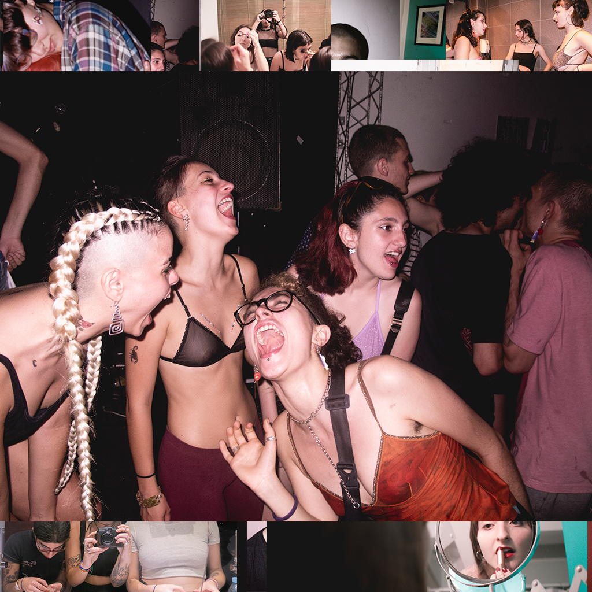

#### _¿generación rota?_ 

_El 2016 nos partió la cabeza; en el 2017 nos preguntamos todo una y mil veces; el 2018 nos hizo gritar un montón, nos partió al medio, casi que no dormimos; en el 2019 nos aseguramos de sentirlo todo. 2020 y no encontramos ninguna respuesta, no sabemos si hay algo que entender, creemos que no pero no estamos segurxs de nada._

_Fotografías de un archivo generacional vivo, latente y en constante movimiento ¿qué es un archivo?._

Estas fotografías fueron seleccionadas para el [Ensayo Visual en la Revista Crisis #42](https://revistacrisis.com.ar/imagenes/chapar-con-mi-generacion?fbclid=IwAR2I8z5yrAH6ezh6sLf8AOPaylGTmNqkOUmGgTrSvF8gzsuFrU8Hb8bgtF8# )