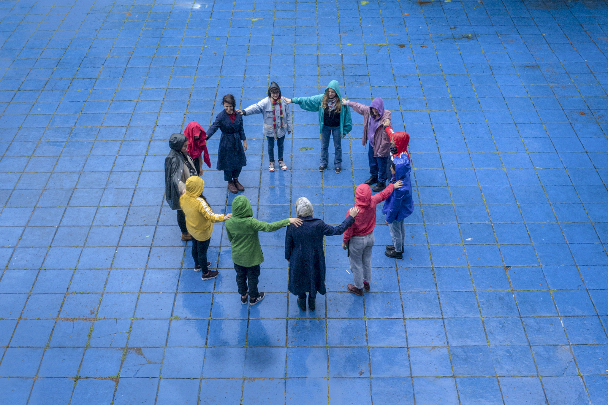
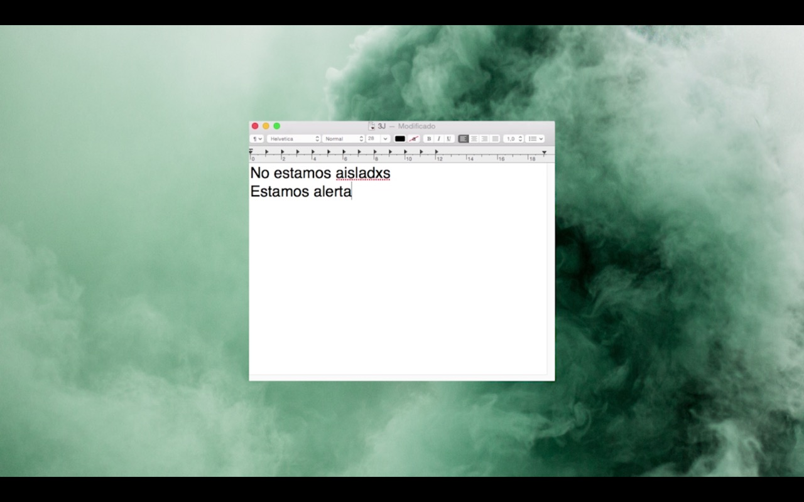

#### Vale Tode

Octubre 2019

Cobertura Colaborativa #ValeTode del 34 Encuentro Plurinacional de Mujeres, Lesbianas, Bisexuales, Travestis, Trans, No binarias, Intersex. 

Participantes: Julieta Christofilakis, Julia Sbriller, Martina Perosa, Lucía Prieto, M.A.f.I.A, Mariana Papagni, Creadores de Imágenes, Romina Elvira y Soledad Asurey. 

12, 13 y 14 de Octubre del 2019 en La Plata, Argentina.

[VER VIDEO](https://www.instagram.com/tv/B3ziAb8FWSM/)

#### 3J 2020. No estamos aisladxs, estamos alerta.

Junio 2020

Video realizado colectivamente desde el encierro para el 3 de Junio 2020. Ni unx menos en cuarentena. 

Participantes: Julieta Christofilakis, Vale Dranosvky, Lucía Prieto, Mariana Papagni, Martina Perosa, M.A.f.I.A, Catalina Bartolomé, OCP Oráculo, Coni Rosman y Guadalupe Arriegue

[VER VIDEO](https://www.instagram.com/tv/CA-dC5WA7EE/)