. Trabajo en proceso / Work in progress . 

Tengo 21 años y con mi cámara como acompañante me siento en plena construcción de mi diario íntimo, un relato de mis estados de ánimo sola y acompañada.

¿Qué siento cuando te miro? ¿Me miro cuando te miro? ¿Qué siento cuando me miro?

Me considero parte de una generación que tiene muchas mas dudas que certezas, que intenta separar el deseo de la identidad. Una generación que reivindica sufrir y apoyarse en el hombro ajeno pero que al mismo tiempo quiere que los vínculos dejen de doler.  ¿Cuándo deja unx de ser joven?

Estas dualidades se pueden ver en la elección del dispositivo: cámara de medio cuadro. Las imágenes dialogan y el azar empieza a tomar un rol protagónico al perder la cuenta de las fotografías sacadas. 

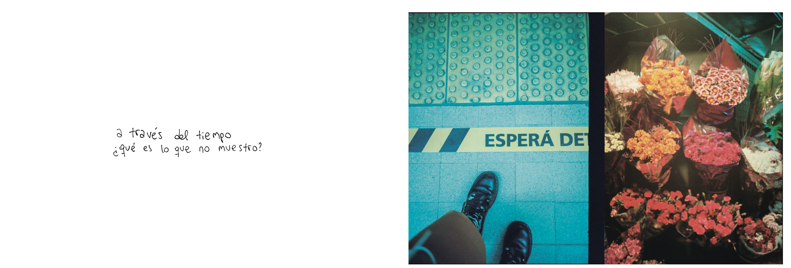

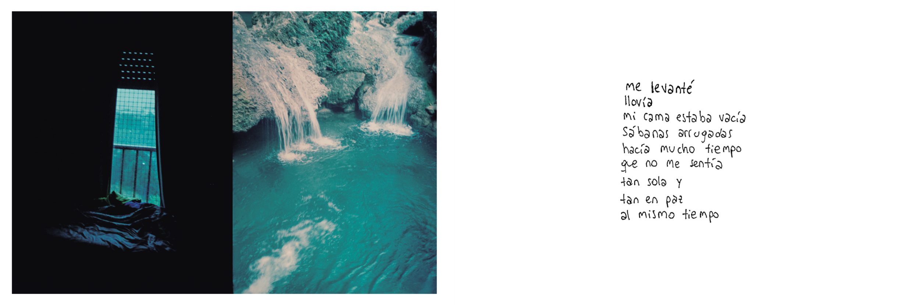

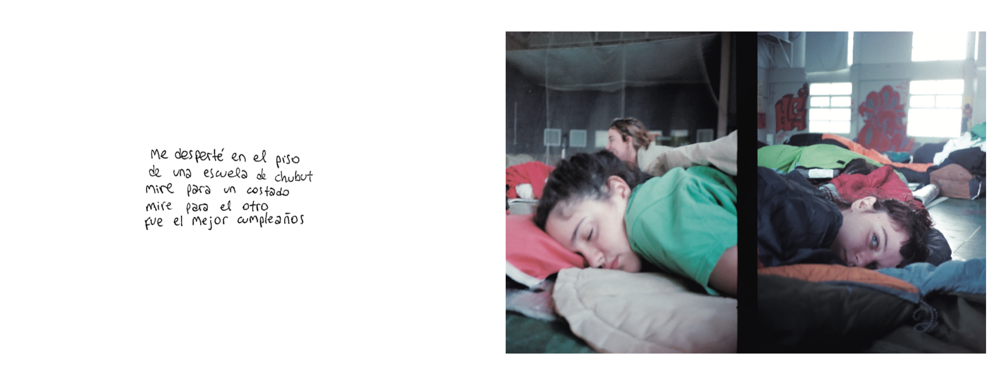

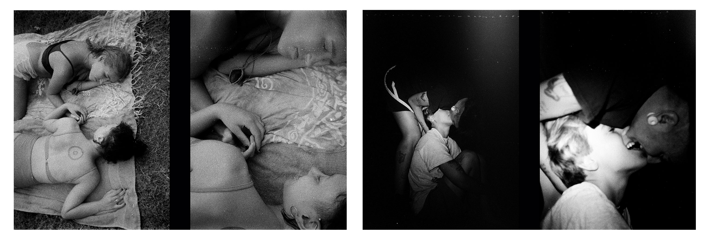

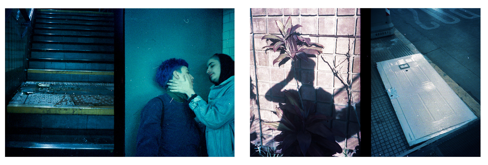

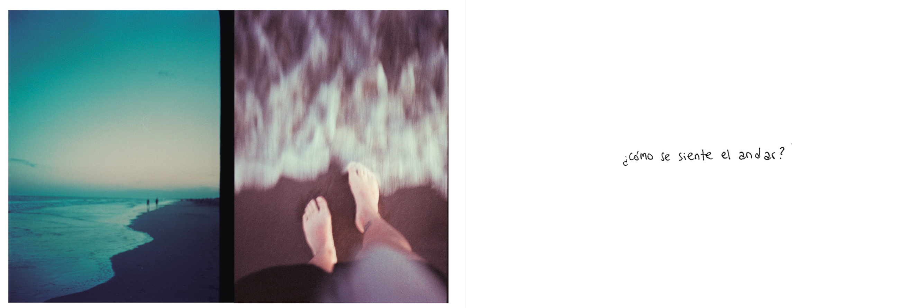

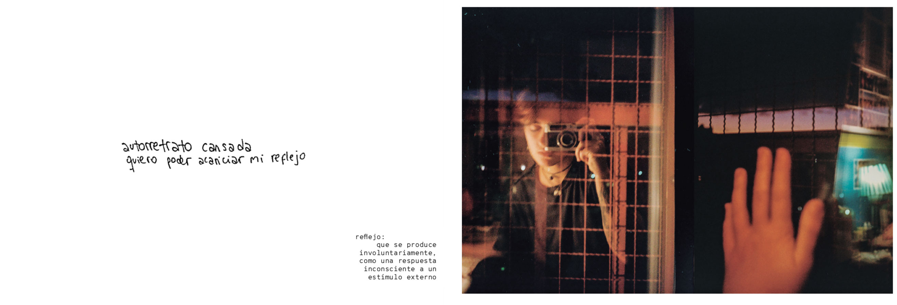

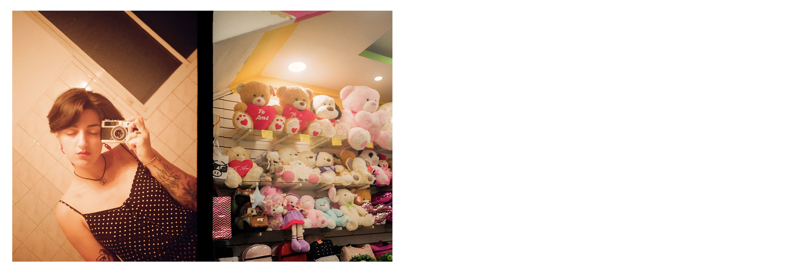

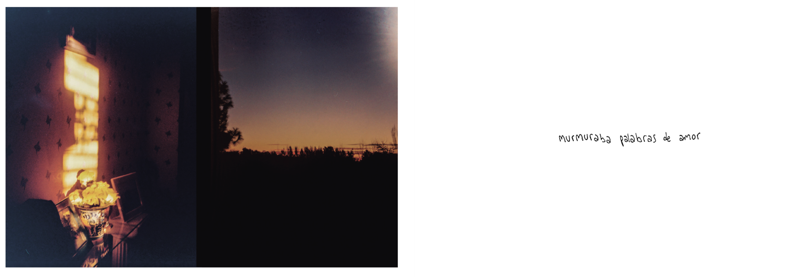

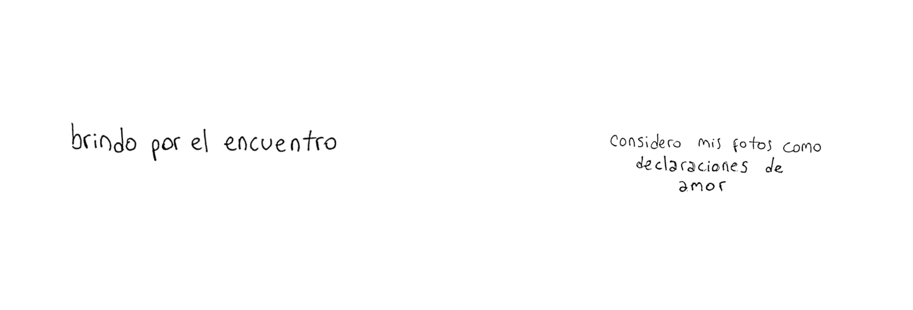

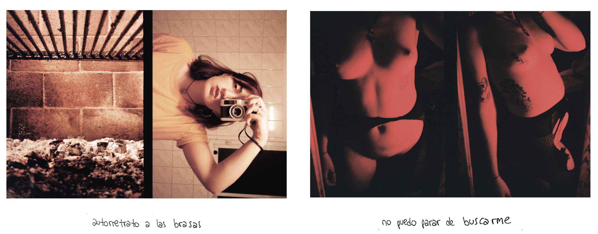

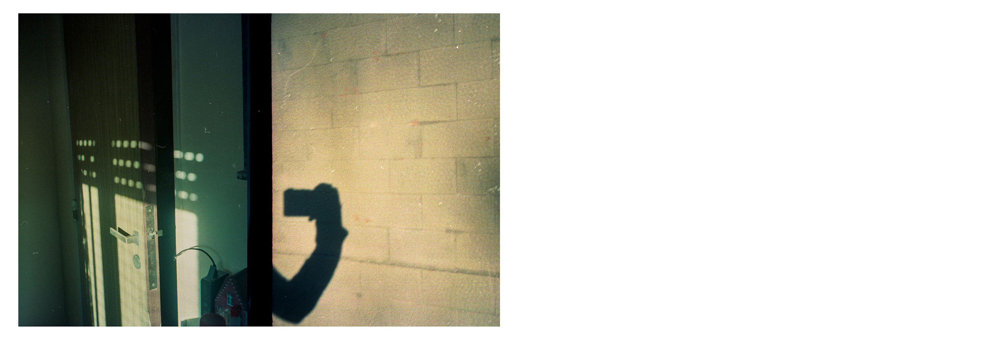

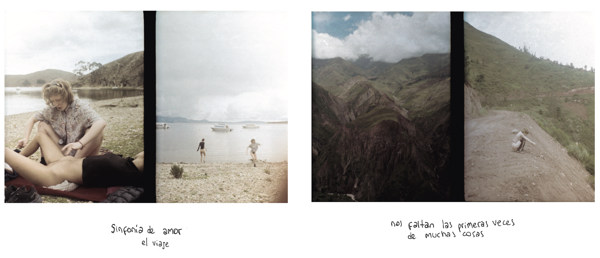

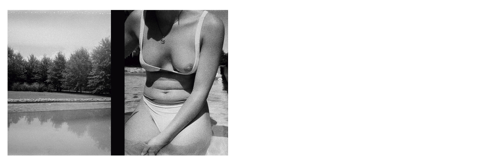

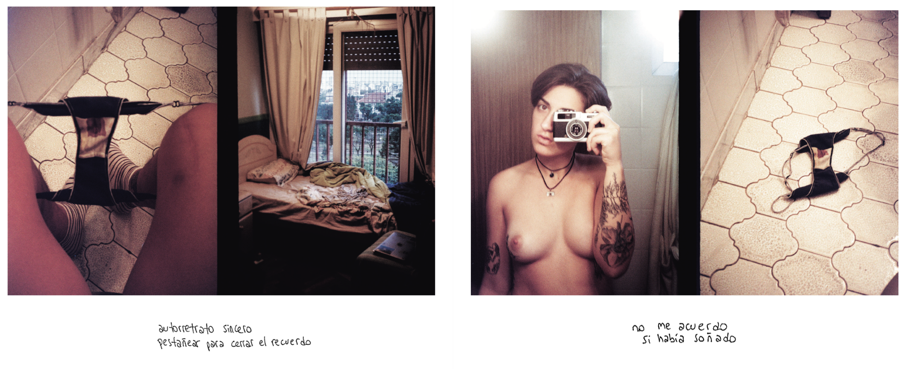

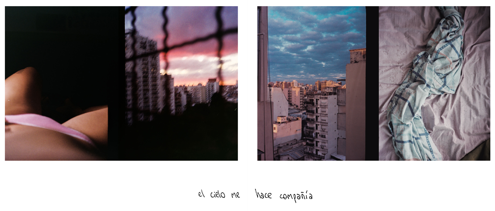

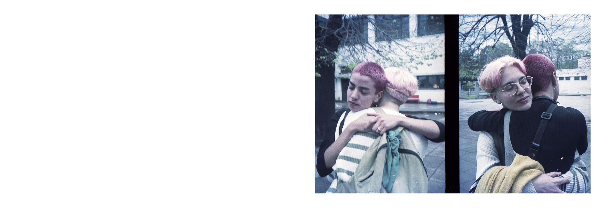

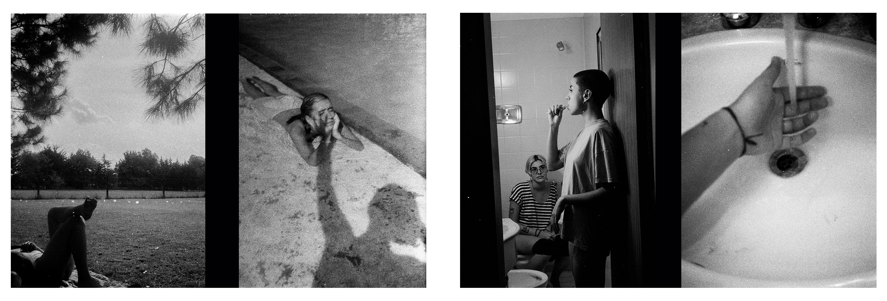

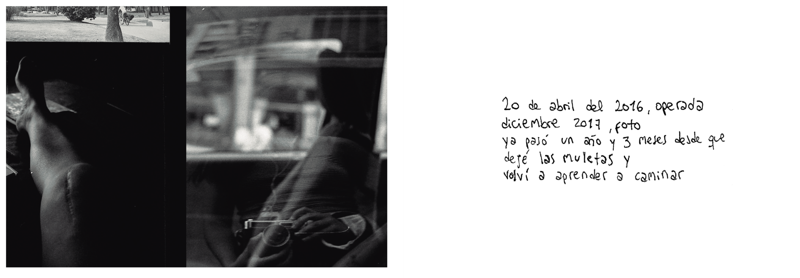

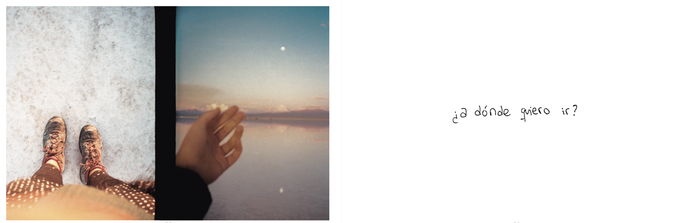

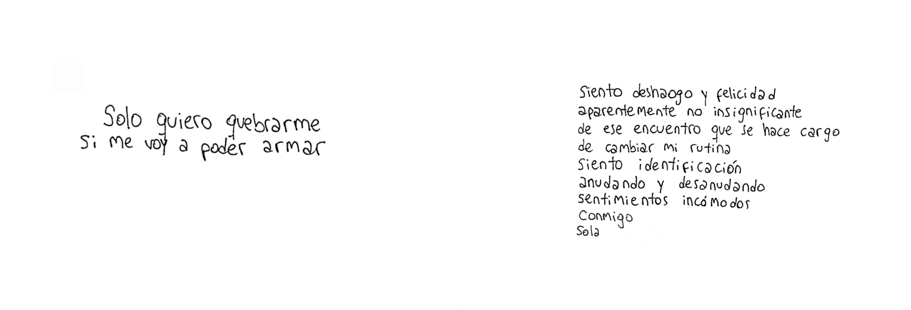