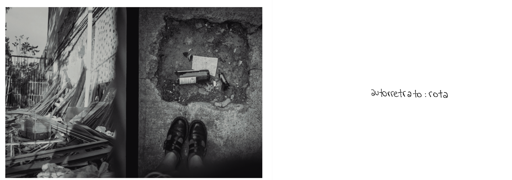
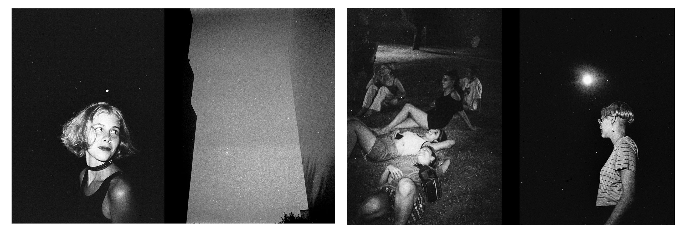
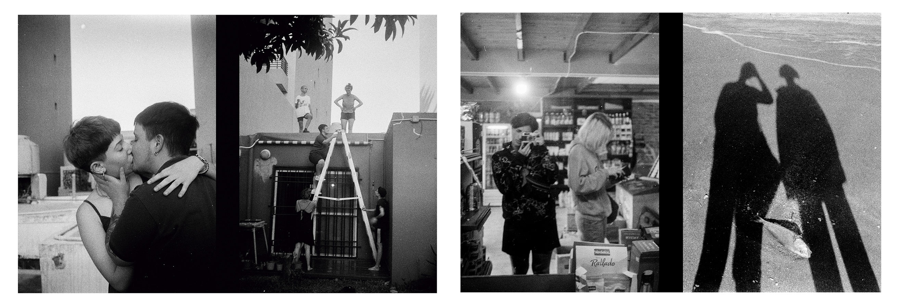
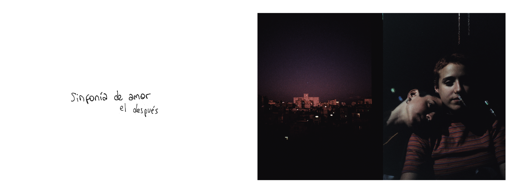
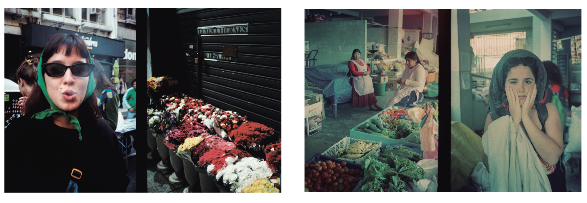
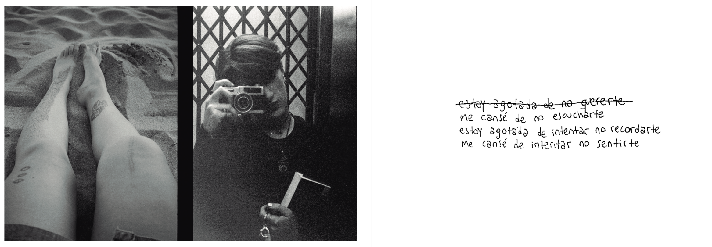
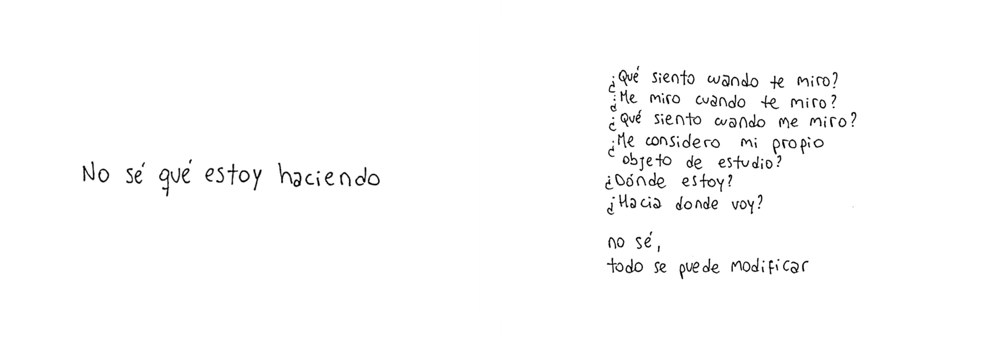
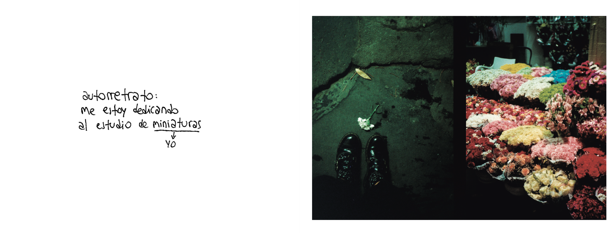

le debo todo al azar

_Tengo 21 años y con mi cámara como acompañante me siento en plena construcción de mi diario íntimo, un relato de mis estados de ánimo sola y acompañada._

_¿Qué siento cuando te miro? ¿Me miro cuando te miro? ¿Qué siento cuando me miro?_

_Me considero parte de una generación que tiene muchas mas dudas que certezas, que intenta separar el deseo de la identidad. Una generación que reivindica sufrir y apoyarse en el hombro ajeno pero que al mismo tiempo quiere que los vínculos dejen de doler.  ¿Cuándo deja unx de ser joven?_

_Estas dualidades se pueden ver en la elección del dispositivo: cámara de medio cuadro. Las imágenes dialogan y el azar empieza a tomar un rol protagónico al perder la cuenta de las fotografías sacadas._

(trabajo en proceso / work in progress) 

_qué lindo que es el signo de pregunta,  
da muchas posibilidades ¿no?  
además de que es curvo, como una cintura o una cadera.  
las instrucciones también dan posibilidades,  
la posibilidad de seguirlas o no.  
las preguntas son regalos; ¿las preguntas son regalos?_

_ponele a todo signos de pregunta.  
busca las respuestas.  
encontrá más preguntas._

 1. _¿la respuesta es respuesta de que pregunta?_
 2. _¿el fragmento es fragmento de qué fragmento?_
 3. _¿tenés límites?_
 4. _¿saco fotos para coleccionar lo que no puedo coleccionar?_
 5. _¿se pueden visualizar las orillas?_
 6. _¿en las orillas están los límites?_
 7. _¿mirás para abajo lo suficiente?_
 8. _¿solo se que no se nada?_
 9. _¿tengo más dudas que certezas?_
10. _¿sé lo que quiero?_
11. _¿me dejo ver? ¿cómo?_
12. _¿me estoy conociendo?_
13. _¿tengo una identidad mutable?_
14. _¿qué escondo? ¿me escondo?_
15. _¿tenés certezas?_
16. _¿con quién compartís?_
17. _¿hay un fin?_
18. _¿algo puede ser eterno?_
19. _¿reivindico la duda?_
20. _¿el medio cuadro es un diálogo?_
21. _¿me encuentro cuando siento?_
22. _¿hiciste un collage de vos misma?_
23. _¿a qué le tenés miedo?_
24. _¿me obsesioné con algo?_
25. _¿aprendiste a tapar sin tachar?_
26. _¿saco fotos de las cosas que no quiero olvidar?_
27. _¿disfruto del sol en la cara?_
28. _¿veo las sábanas arrugadas?_
29. _¿cuántas veces al día miro por la ventana?_
30. _¿hay cosas que quiero volver a ver cuando yo quiera?_
31. _¿me doy la mano a mi misma?_
32. _¿hay lugares por los que dejo alguna huella?_
33. _¿los lugares dejan huellas en mi?_
34. _¿me acerco cuando hago fotos?_
35. _¿cierro los ojos para verme de otra manera?_
36. _¿dejás que te miren cuando miras?_
37. _¿escuchas canciones de amor para intentar entenderlo?_
38. _¿las definiciones tienen sentido?_
39. _¿por qué busco las palabras en el diccionario?_
40. _¿miras para arriba lo suficiente?_
41. _¿por qué cuando me acuesto cierro los ojos?_
42. _¿me considero un collage? ¿de qué?_
43. _¿atravieso la orilla?_
44. _¿por qué tenés un diario?_
45. _¿colecciono definiciones?_
46. _¿quiero acariciar mi reflejo?_
47. _¿qué es lo que no muestro?_
48. _¿cómo se siente el andar?_
49. _¿murmure palabras de amor?_
50. _¿no puedo parar de buscarme?_
51. _¿nos faltan las primeras veces de muchas cosas?_
52. _¿me acuerdo lo que sueño?_
53. _¿pestañeo para cerrar el recuerdo?_
54. _¿vivimos jugando a vivir?_
55. _¿sé a dónde quiero ir?_
56. _¿sólo quiero quebrarme si me voy a poder volver a armar?_
57. _¿quiero juntar nuestras sombras?_
58. _¿qué siento cuando te miro?_
59. _¿me miro cuando te miro?_
60. _¿qué siento cuando me miro?_
61. _¿me cuesta diferenciar el recuerdo del sueño?_
62. _¿me considero mi propio objeto de estudio?_
63. _¿le debo todo al azar?_

[**Entrevista en la sección "Fotógrafe de la semana" en Colibrí Revista**](https://revistacolibri.com.ar/fotografe-semana-debo-todo-azar-julieta-christofilakis/?fbclid=IwAR3ZIcc6xLqcsagx5is82GZ7lkLGH1FPSlLCkKLU1EETYbH4h94e47wYfQs)